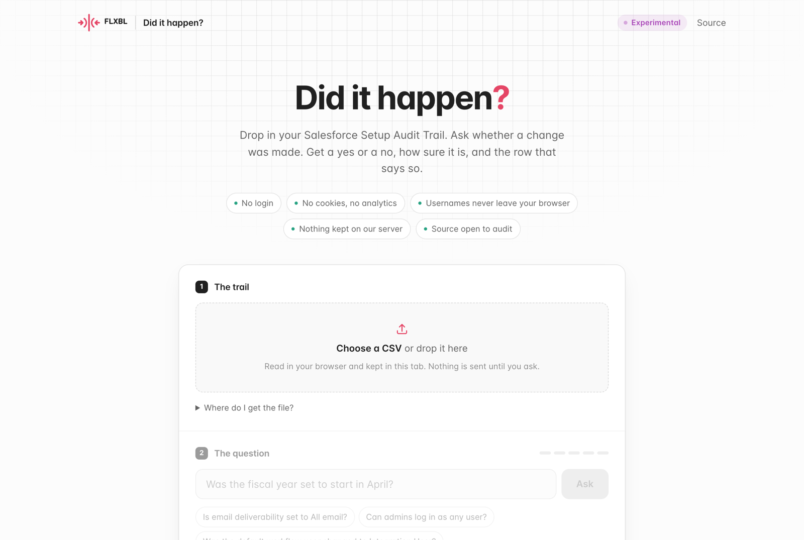
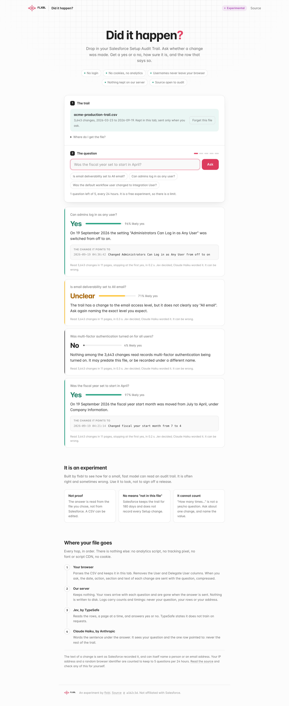
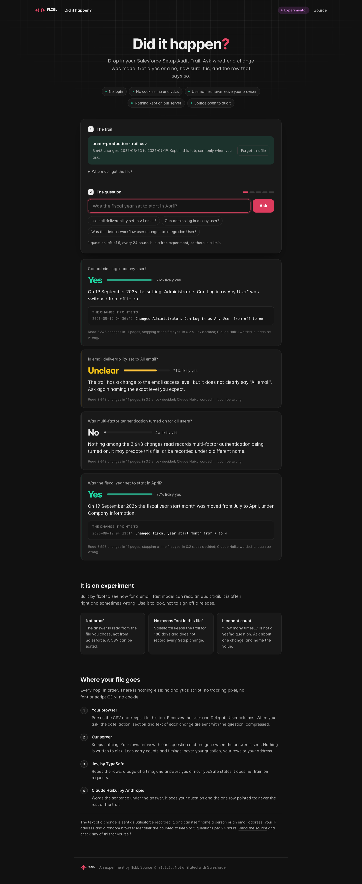
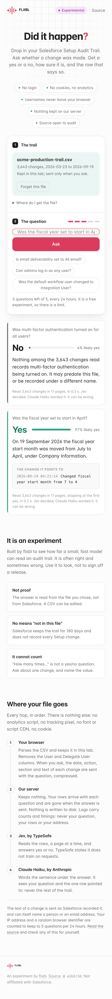
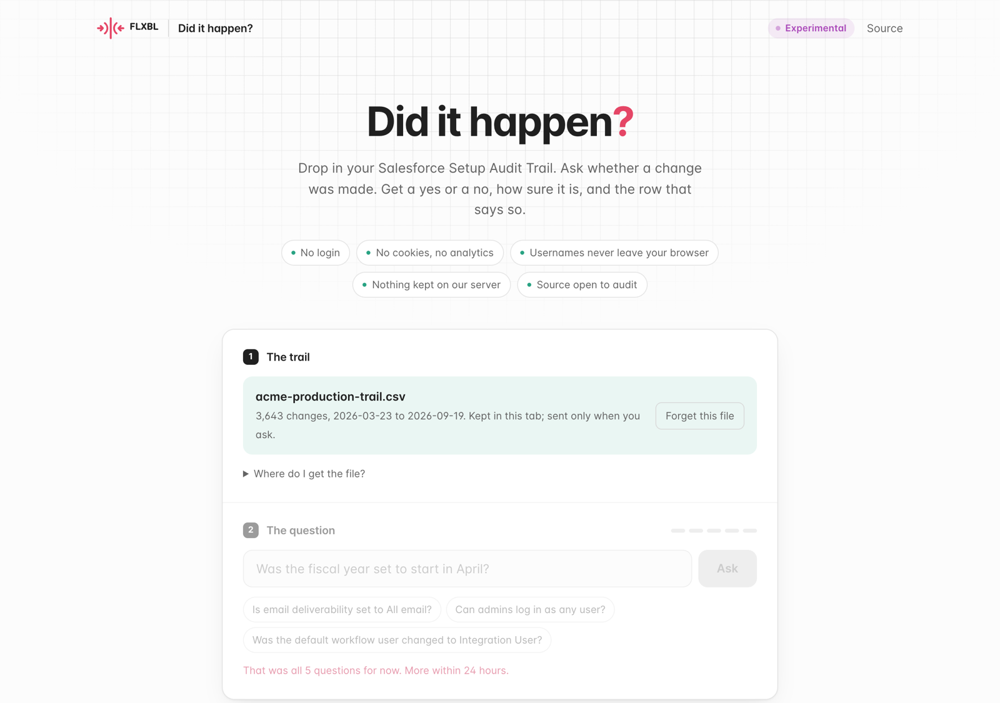

# Mocks

Screenshots of the page running locally, taken before it became Ask Flux (it was then "Did it happen?"), in flxbl.io's palette, type and logo. The data is synthetic
(`acme-production-trail.csv`) and the answers are canned, so nothing here came from a real org.

## 1. First visit

The promises sit under the headline. "Experimental" is in the bar on every screen. Nothing loads from another origin.

## 2. Answers: yes, unclear, no

The verdict is printed by code from Jev's probability. The sentence under it is Claude Haiku's wording, and says
so. A yes shows the row it points to. Below: the experiment notice, and every hop the file takes.

## 3. Dark (since removed)

The page then followed the visitor's system setting. It is light only now.

## 4. Phone (390 px)

## 5. Five questions used

The meter empties, the input locks, and the message says when more are available.

